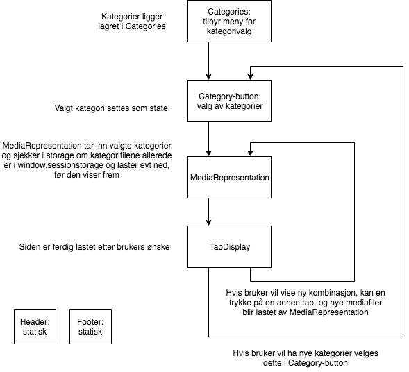

# it2810-webutvikling-h18-prosjekt-2-gruppe--32
Project 2 - IT 2810 created by GitHub Classroom  

README only available in Norwegian language.

---

# intexpo

### intexpo er et gruppeprosjekt utført i forbindelse med emnet IT2810 - Webutvikling ved Institutt for datateknologi og informatikk ved NTNU Gløshaugen, Trondheim

#### Prosjektet består av en single page application (SPA) med responsivt webdesign skrevet i React med minimal bruk av eksterne rammeverk og ferdigbygde React-komponenter.

---

## Bruk
Applikasjonens formål er å vise en online utstilling med brukerstyrte kombinasjoner av lyd, SVG-grafikk og tekst lagret i JSON-format. 
Dette skal vises som en single page application styrt av React, og data skal lastes automatisk ved bruk av AJAX-kall. 
Ved innlasting første gang skal siden vise en generert utstilling før brukeren eventuelt kan velge en ny kombinasjon basert på de samme kategoriene, eller eventuelt velge seg nye kategorier. 
Utstillingen skal bli automatisk oppdatert ved valg av nye kombinasjoner eller kategorier.

---

## Teknologi
Prosjektet er som tidligere nevnt designet og utviklet i React, da formålet ved prosjektet var å bygge erfaring med bruk av React. 
Som spesifisert i oppgaveteksten har vi også lagt vekt på å unngå bruk av ferdige komponenter, og tredjepartsbiblioteker.
Dette inkluderer at vi har hardkodet tab-displayet som ble etterspurt i oppgaveteksten.

### Komponentarkitektur
Noe av det første vi gjorde med dette prosjektet etter å ha sett gjennom dokumentasjonen for React, var å diskutere om vi kunne modellere hoveddelen av applikasjonen ut fra et React-perspektiv.
Her fant vi ut at vi skulle forsøke å modellere hvilke komponenter vi fikk behov for, og hvordan disse skulle interagere.
Dette resulterte i diagrammet under der programflyten er forsøkt modellert:

Fokuset her var å oppnå hensiktsmessig gjenbruk av komponenter, hovedsaklig for å lette utvikling og eventuell feilsøking for oss selv, samt at koden skulle være så grei å vedlikeholde og videreutvikle som mulig. 
Her har vi møtt litt motstand, men etterhvert landet på noe som ligner på det som opprinnelig ble modellert. 

### Stilvalg
For å oppnå et godt og hensiktsmessig responsivt design har vi valgt å implementere en sidestruktur basert på CSS Flexbox, noe som sikrer en flytende / fleksibel layout.
Grunnlaget for dette er at vi med vårt design egentlig bare er avhengig av kontroll i en dimensjon / retning for å sikre at elementer på siden legger seg et nedover siden ved ulike skjermstørrelser. 
For å kontrollere innhold i forhold til skjermstørrelse prøvde vi også å ta i bruk CSS3-enhetene *vh* og *vw* for å oppgi tilgjengelig skjermstørrelse definert av viewporten. Dette ga oss noen egentlig ganske logiske feil, ved skalering av nettleservinduet, så dette ble til slutt valgt bort.
Helt konkret ble siden vanskelig å bruke dersom nettleservinduet nærmet seg 2-300 piksler i høyde, ettersom viewporten da ble veldig liten.
Dette kunne blitt korrigert av mange media queries, men vi valgte heller å korrigere det ved å bruke prosent og em som enheter.
Vi har også valgt å benytte oss av media-queries for å sikre nødvendige tilpasninger for enheter som mobiltelefon og nettbrett. 
Vi har også sikret at grafikk skalerer på en hensiktsmessig måte.

### Tredjepartskomponent for AJAX-kall
Vi har valgt å benytte biblioteket [Fetch](https://developer.mozilla.org/en-US/docs/Web/API/Fetch_API) for å håndtere AJAX-kall mot våre mediafiler.
Her stod valget i realiteten mellom valgte Fetch og alternativet Axios.  
Fetch ble her valgt da det var veldokumentert og derfor greit å komme i gang med. 
Det ble også tatt i betraktning at Fetch APIet kanskje kan bli HTML-standard en dag, og at det derfor kan være greit å implementere først som sist. 
Alternativet Axios hadde også bra dokumentasjon, spesielt knyttet opp mot React, men Fetch ble likevel valgt da det muligens blir standard, og var greit å komme i gang med.

### Lagring av mediafiler hos klient
Et av oppgavekravene vi hadde størst problemer med å oppfylle var kravet om at grafikk og tekst kunne skulle lastes ved behov, og maksimalt én gang. 
Her vurderte vi flere mulige approacher, før vi til slutt landet på å lagre den tekstvise representeringen av filene til det som kalles [sessionStorage (HTML5)](https://developer.mozilla.org/en-US/docs/Web/API/Web_Storage_API/Using_the_Web_Storage_API). 
De andre alternativene vi vurderte var å lagre filene i State, noe som kunne løst problemet, men som fordrer at denne Staten løftes frem og tilbake dit den trengs. 
Et annet alternativ var å benytte seg av [Web-APIet IndexedDB](https://developer.mozilla.org/en-US/docs/Web/API/IndexedDB_API), men dette ble vurdert som noe avansert for vårt relativt enkle bruksområde med et forholdsvis lite antall filer. 
Vi vurderte også en ganske "hacky" løsning med mediafiler i skjulte HTML-divs, men dette ble lagt bort til fordel for en ryddigere løsning som viste seg å være lagring av tekstvis representasjon i sessionStorage.

## Testing
Vi har testet prosjektet vårt med nettleseren Google Chrome sitt verktøy for å simulere ulike skjermstørrelser. 
I tillegg har vi også testet prosjektet på diverse enheter. 
Utenom våre egne PCer (MacOS Safari 1600x900 og Windows Chrome 1920x1080), har vi også testet på iPhone 6S, iPad Air og Motorola G5 Plus (1080x1920) både horisontalt og vertikalt gjennom IP.

## Versjonskontroll
Som oppgaven legger opp til har vi benyttet Git og Github Classroom for versjonskontroll av prosjektet.
Vi har også valgt å ta i bruk tilhørende deler av Github som f.eks. Issues og Projects for å ha bedre kontroll med arbeidsflyten, og for å dokumentere hvem som har gjort hva. I utgangspunktet brukte vi Trello som alene har noe bedre funksjonalitet enn Github Projects, men vi konkluderte med at gevinsten med å ha alt samlet på en tjeneste var større enn gevinsten den ekstra funksjonaliteten kunne tilby.

## Bidragsytere
- Jonas Jevnaker Aas
- Svenn Roland Refsnes Grønbeck
- Tore Stensaker Tefre

---

## Kreditering for mediafiler

### Lydfiler

Alle lydfiler er hentet fra freesound.org med lisensen [CC0](https://creativecommons.org/share-your-work/public-domain/cc0/), og krediteres derfor ikke.

### Bilder
Bildene er hentet fra www.Flaticon.com med [Flaticon Basic License](https://file000.flaticon.com/downloads/license/license.pdf) – Kan brukes med kreditering av opphavsmann / -organisasjon 

Bildene er sortert i ulike kataloger / kategorier:

#### Abstrakt

Bilde 1: https://www.flaticon.com/free-icon/logo_187851#term=abstract&page=1&position=48 (Av Roundicons)

Bilde 2: https://www.flaticon.com/free-icon/floral_187857#term=abstract&page=1&position=53 (Av Roundicons)

Bilde 3: https://www.flaticon.com/free-icon/logo_187902#term=abstract&page=1&position=19 (Av Roundicons)

Bilde 4: https://www.flaticon.com/free-icon/logo_187883#term=abstract&page=1&position=37 (Av Roundicons)

#### Dyr

Bilde 1: https://www.flaticon.com/free-icon/bird_214271#term=animal&page=1&position=22 (Av Pixel Buddha)

Bilde 2: https://www.flaticon.com/free-icon/fish_135677#term=animal&page=1&position=5 (Av Smashicons) 

Bilde 3: https://www.flaticon.com/free-icon/flamingo_878056#term=flamingo&page=1&position=5 (Av Freepik)

Bilde 4: https://www.flaticon.com/free-icon/owl_167742#term=animal&page=1&position=23 (Av Freepik) 

#### Biler

Bilde 1: https://www.flaticon.com/free-icon/car_171239#term=car&page=1&position=9 (Av Freepik)

Bilde 2: https://www.flaticon.com/free-icon/taxi_1008091#term=car&page=1&position=84 (Av Freepik) 

Bilde 3: https://www.flaticon.com/free-icon/suv_296208#term=car&page=1&position=42 (Av Freepik)

Bilde 4: https://www.flaticon.com/free-icon/racing_263396#term=car&page=1&position=49 (Av Freepik)
